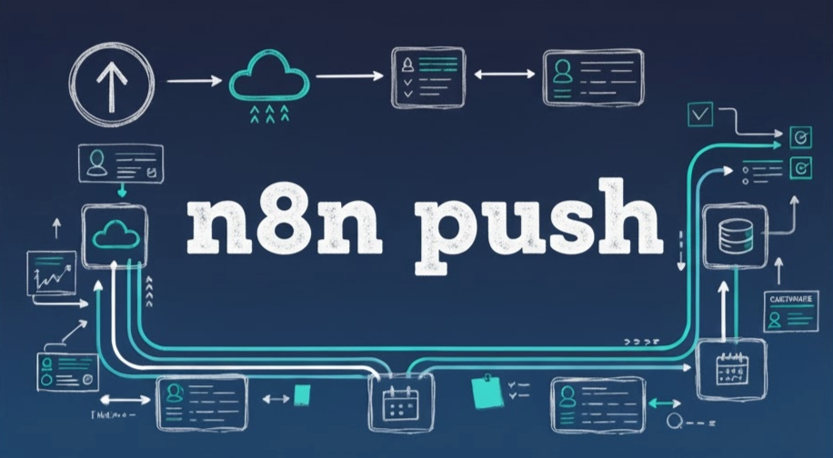

# n8n-manager: Backup & Restore for n8n Docker via GitHub
<!-- ALL_BADGES_START -->
[](https://github.com/Automations-Project/n8n-data-manager/actions/workflows/ci.yml) [](https://github.com/Automations-Project/n8n-data-manager/releases/latest) [](https://github.com/Automations-Project/n8n-data-manager/actions/workflows/ci.yml?query=branch%3Amain) [](LICENSE)
[](https://github.com/Automations-Project/n8n-data-manager/stargazers) [](https://github.com/Automations-Project/n8n-data-manager/network/members) [](https://github.com/Automations-Project/n8n-data-manager/graphs/contributors) [](https://github.com/Automations-Project/n8n-data-manager/issues)
[](https://github.com/Automations-Project/n8n-data-manager/commits/main) [](https://github.com/Automations-Project/n8n-data-manager) [](./#)
[](https://github.com/Automations-Project/n8n-data-manager) [](./#) 
<!-- ALL_BADGES_END -->



`n8n-manager` is a robust command-line tool designed to simplify the backup and restore process for your [n8n](https://n8n.io/) instances running in Docker containers. It leverages Git and GitHub to securely store and manage your n8n workflows, credentials, and environment variables.

This script provides both interactive and non-interactive modes, making it suitable for manual use and automation/CI/CD pipelines.

## ✨ Features

*   **Interactive Mode:** User-friendly menus guide you through selecting containers and actions.
*   **Non-Interactive Mode:** Fully automatable via command-line arguments, perfect for scripting.
*   **GitHub Integration:** Backs up n8n data (workflows, credentials, environment variables) to a private or public GitHub repository.
*   **Backup Options:**
    *   **Standard Backup:** Overwrites the latest backup files on the specified branch.
    *   **Dated Backups (`--dated`):** Creates timestamped subdirectories (e.g., `backup_YYYY-MM-DD_HH-MM-SS/`) for each backup, preserving history.
*   **Restore Options:**
    *   **Selective Restore:** Use `--credentials` to restore only credentials, or `--workflow` to restore only workflows. You can specify either or both flags to control exactly what gets restored.
    *   **Project-Aware Restore:** Directories for projects are honored, and workflows without paths set fall back to the configured default project (`--project` flag or `N8N_PROJECT` config entry), independent of where backups live in Git.
    *   **Flexible Git Layout:** Use `N8N_PATH` (or `--github-path`) to pick a repository subdirectory for backups without changing the default project selection.
*   **Container Compatibility:**
    *   **Alpine Support:** Fully compatible with n8n containers based on Alpine Linux.
    *   **Ubuntu Support:** Works seamlessly with containers based on Ubuntu/Debian.
*   **Safety First:**
    *   **Pre-Restore Backup:** Automatically creates a temporary local backup of current data before starting a restore.
    *   **Automatic Rollback:** If the restore process fails, the script attempts to automatically roll back to the pre-restore state.
    *   **GitHub Pre-Checks:** Verifies GitHub token validity, required scopes (`repo`), repository existence, and branch existence (for restore) before proceeding.
    *   **Dry Run Mode (`--dry-run`):** Simulate backup or restore operations without making any actual changes to your n8n instance or GitHub repository.
*   **Robust Error Handling:**
    *   **Shell-Safe Operations:** All operations use explicit string comparisons and proper error checks to avoid common shell pitfalls.
    *   **Descriptive Error Messages:** Clear error messaging with specific details about what went wrong.
    *   **Improved File Validation:** Smart checks ensure n8n files are valid before attempting import operations.
*   **Configuration File:** Store default settings (token, repo, container, etc.) in `~/.config/n8n-manager/config` for convenience.
*   **Enhanced Logging:**
    *   Clear, colored output for interactive use.
    *   Verbose/Debug mode (`--verbose`) for detailed troubleshooting.
    *   Option to log all output to a file (`--log-file`).
    *   Trace mode (`--trace`) for in-depth debugging.
*   **Dependency Checks:** Verifies required tools (Docker, Git, curl) are installed on the host.
*   **Container Detection:** Automatically detects running n8n containers.

## 📋 Prerequisites

*   **Host Machine:**
    *   Linux environment (tested on Ubuntu, should work on most distributions).
    *   `docker`: To interact with the n8n container.
    *   `git`: To interact with the GitHub repository.
    *   `curl`: To perform GitHub API pre-checks.
    *   `bash`: The script interpreter.
*   **n8n Container:**
    *   Must be running.
    *   Must be based on an official n8n image (or include the `n8n` CLI tool).
    *   The `git` command is *not* required inside the container.
*   **GitHub:**
    *   A GitHub account.
    *   A GitHub repository (private recommended) to store the backups.
    *   A [GitHub Personal Access Token (PAT)](https://docs.github.com/en/authentication/keeping-your-account-and-data-secure/managing-your-personal-access-tokens) with the `repo` scope enabled. This scope is necessary to access repositories (both public and private) and push changes.

## 🚀 Installation

You can install `n8n-manager` using the provided installation script. This will download the main script and place it in `/usr/local/bin` for easy system-wide access.

**Note:** You need `curl` and `sudo` (or run as root) for the installation.

```bash
curl -sSL -L https://i.n8n.community | sudo bash
```

Alternatively, you can download the `n8n-manager.sh` script manually, make it executable (`chmod +x n8n-manager.sh`), and run it directly (`./n8n-manager.sh`) or place it in your desired `$PATH` directory.

## ⚙️ Configuration File (Optional)

You can bootstrap your configuration in two ways:

1. **Interactive wizard:** Run the script with the configure action to generate a config from guided prompts (you can choose `./.config`, the user config path, or any custom/`--config` location).

    ```bash
    n8n-manager.sh --action configure
    ```

    The same wizard is available in the interactive menu (`Configure defaults`). It captures GitHub settings when needed, workflow storage preferences, folder structure options, and writes the file with secure permissions.

2. **Manual copy/edit:** Start from the sample config if you prefer to edit values yourself.

For convenience, you can create a configuration file to store default settings. The script looks for this file at `~/.config/n8n-manager/config` by default. You can specify a different path using the `--config` argument.

Create the directory if it doesn't exist:

```bash
mkdir -p ~/.config/n8n-manager
```

Copy the annotated template that ships with the project and edit it to match your setup:

```bash
cp .config.example ~/.config/n8n-manager/config
```

Set permissions for security
```bash
chmod 600 ~/.config/n8n-manager/config
```

The example file shows supported options. Open it in your editor and adjust the sections that matter:

*   **GitHub access:** `GITHUB_TOKEN`, `GITHUB_REPO`, and optional `GITHUB_BRANCH`, commit identity, or `GITHUB_PATH` subdirectory.
*   **Default project selection:** `N8N_PROJECT` should be the literal project name as it appears in n8n. Path-like values are treated literally now.
*   **Optional location :** Set `N8N_PATH` when you want to back up or restore a nested folder structure inside the chosen project; leave it empty to land at the project root.
*   **Storage modes & logging:** `WORKFLOWS`, `CREDENTIALS`, `ENVIRONMENT`, `DATED_BACKUPS`, `VERBOSE`, and related flags control how data is stored and how much output you see.
*   **Folder structure export:** Configure `FOLDER_STRUCTURE`, `N8N_BASE_URL`, `N8N_API_KEY`, or `N8N_LOGIN_CREDENTIAL_NAME` if you mirror the n8n UI folder layout.

**Security Note:** Ensure the configuration file has appropriate permissions (e.g., `chmod 600 ~/.config/n8n-manager/config`) as it contains your GitHub PAT. Keep the file out of version control.

Command-line arguments always override settings from the configuration file.

When restoring workflows, `n8n-manager` uses the project specified by `--project` or `N8N_PROJECT`. The workflows land inside the folder represented by `N8N_PATH` when set; otherwise, they import at the project root.

## 💡 Usage

### Interactive Mode

Simply run the script without any arguments (or only optional ones like `--verbose`):

```bash
n8n-manager.sh
```

The script will guide you through:
1.  Selecting the action (Backup/Restore).
2.  Selecting the target n8n container.
3.  Entering GitHub details (Token, Repo, Branch) if not found in the config file or provided via arguments.
4.  Confirming potentially destructive actions (like restore).

### Non-Interactive Mode

Provide all required parameters via command-line arguments. This is ideal for automation (e.g., cron jobs).

```bash
n8n-manager.sh --action <action> --container <id|name> --token <pat> --repo <user/repo> [OPTIONS]
```

**Required Arguments for Non-Interactive Use:**

*   `--action <action>`: `backup` or `restore`.
*   `--container <id|name>`: The name or ID of the running n8n Docker container.
*   `--token <pat>`: Your GitHub PAT.
*   `--repo <user/repo>`: Your GitHub repository.

**Optional Arguments:**

*   `--branch <branch>`: GitHub branch to use (defaults to `main`).
*   `--project <name>`: Project to target when restoring workflows unless a directory explicitly overrides it. Provide the exact name as shown in n8n; path-like values are treated literally.
*   `--dated`: (Backup only) Create a timestamped subdirectory for the backup.
*   `--environment <mode>`: Control environment backups (`0` disabled, `1` local, `2` remote Git).
*   `--dry-run`: Simulate the action without making changes.
*   `--verbose`: Enable detailed debug logging for troubleshooting.
*   `--trace`: Enable in-depth script debugging with bash execution trace.
*   `--log-file <path>`: Append all logs (plain text) to the specified file.
*   `--config <path>`: Use a custom configuration file path.
*   `-h`, `--help`: Show the help message.

**Example: Non-Interactive Backup**

```bash
n8n-manager.sh \
  --action backup \
  --container my-n8n-container \
  --token "ghp_YourToken" \
  --repo "myuser/my-n8n-backup" \
  --branch main \
  --dated \
  --log-file /var/log/n8n-backup.log
```

**Example: Non-Interactive Restore (Workflows Only)**

```bash
n8n-manager.sh \
  --action restore \
  --container my-n8n-container \
  --token "ghp_YourToken" \
  --repo "myuser/my-n8n-backup" \
  --branch main
```

## 🔄 Backup & Restore Process

### Backup

1.  **Connect:** Establishes connection parameters (container, GitHub details).
2.  **Pre-Checks:** Verifies GitHub token, scopes, and repository access.
3.  **Git Prep:** Clones or fetches the specified branch into a temporary directory.
4.  **Export:** Executes `n8n export:workflow` and `n8n export:credentials` inside the container.
5.  **Environment (optional):** Captures `N8N_` environment variables when environment backups are enabled.
6.  **Copy:** Copies the selected artifacts (`workflows.json`, credentials, `.env`) into either local secure storage or the temporary Git directory, respecting each component's storage mode. Remote credentials are written to the configurable credentials folder (default: `.credentials/credentials.json`), while workflow exports remain at the repository root unless folder-structured exports are enabled.
7.  **Commit:** Commits the staged changes with a descriptive message summarizing the updated artifacts (optionally suffixed with the backup timestamp).
8.  **Push:** Pushes the commit to the specified GitHub repository and branch.
9.  **Cleanup:** Removes temporary files and directories.

### Restore

1.  **Connect:** Establishes connection parameters.
2.  **Pre-Checks:** Verifies GitHub token, scopes, repository, and *branch* access.
3.  **Confirmation:** Prompts the user for confirmation in interactive mode.
4.  **Pre-Restore Backup:** Exports current workflows and credentials from the container to a temporary local directory (for rollback).
5.  **Fetch:** Clones the specified branch from the GitHub repository.
6.  **Copy to Container:** Copies the `workflows.json` and/or credentials file (from the configured folder, default `.credentials/credentials.json`) from the cloned repo to the container.
7.  **Import:** Executes `n8n import:workflow` and/or `n8n import:credentials` inside the container.
8.  **Cleanup:** Removes temporary files and directories.
9.  **Rollback (on failure):** If any step after the pre-restore backup fails, the script attempts to import the backed-up data back into n8n.

## ⚠️ Error Handling & Rollback

The script includes error trapping (`set -Eeuo pipefail`) and specific checks at various stages. Version 3.0+ includes significantly improved error handling specifically designed to address common issues in shell scripting:

- **Explicit String Comparisons**: Boolean variables and conditions now use explicit string comparisons (e.g., `[ "$variable" = "true" ]`) to avoid empty command errors.
- **Proper Return Values**: All functions have proper return values to avoid the "command not found" errors that occur with empty returns.
- **Robust Git Operations**: Git operations have been restructured to use proper error handling and to verify commands succeed at each step.
- **Alpine Container Compatibility**: Special handling for file operations in Alpine-based containers ensures compatibility regardless of container OS.

## 🔧 Container Compatibility

Version 3.0.5 includes specific improvements for working with different container environments:

### Alpine Linux Containers

Older versions of the script sometimes ran into issues with Alpine-based containers due to differences in shell behavior and file permissions. The latest version includes:

- Use of the `ash` shell for Alpine-specific commands
- More robust file existence checks before operations
- Proper handling of temporary files
- Intelligent error suppression for non-critical operations

### Best Practices for Both Container Types

For optimal performance with both Alpine and Ubuntu/Debian containers:

- Ensure the n8n CLI tool is available in the container
- Check that Docker permissions are sufficient on the host machine
- Consider using a named volume for n8n persistent data

## 📜 Logging

*   **Standard Output:** Provides colored, user-friendly status messages.
*   **Verbose Mode (`--verbose`):** Prints detailed debug information, including internal steps and command outputs.
*   **Log File (`--log-file <path>`):** Appends plain-text, timestamped logs to the specified file, suitable for auditing or background processes.

## 🤝 Contributing

Contributions are welcome! Please feel free to open issues on the GitHub repository.

## 📄 License

This project is licensed under the MIT License. See the [LICENSE](LICENSE) file for details.
